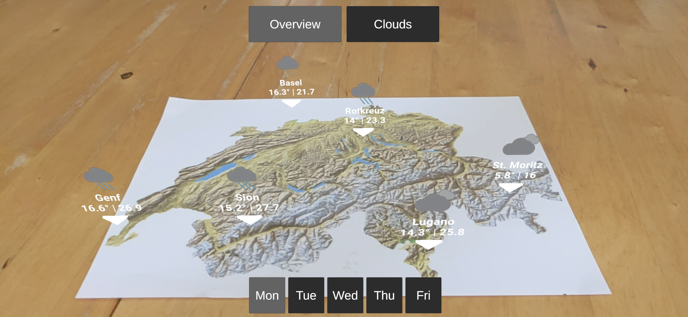
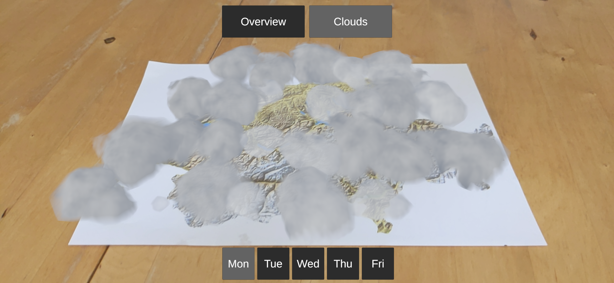

# AR-Weather

AR-Weather is an Android app that I developed using Unity and Vuforia for the AR class at HSLU.

## Usage

**Note:** The `VuforiaConfiguration.asset` file has been removed from the public version of this repository because it contains the Vuforia license key. This means that the project will not work unless you use your own key.

## Screenshots

Overview page:

Cloud Coverage page:

